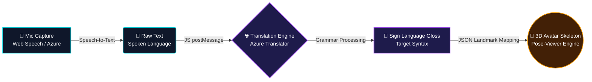

<


---

## 🎯 Core Features & Capabilities

**Inclusive Communication Hub** is an advanced, system-level accessibility platform designed to break down language and auditory barriers. 

- 🌍 **Multi-Language Support:** Real-time translation and recognition across 12+ spoken and signed languages.
- 🎙️ **Audio to Text (STT):** Instant transcription of speech with speaker diarization.
- 🧏 **Audio to Sign Language:** Converts spoken language directly into fluid 3D sign language via a virtual avatar.
- ⌨️ **Text to Sign Language:** Type any sentence and watch the avatar sign it in real-time.
- 🖐️ **Sign Language to Text:** Translates webcam sign language gestures into written text using Edge AI (TensorFlow.js).
- 🔊 **Sign Language to Audio:** Synthesizes signed gestures into spoken audio using Azure Neural TTS.
- ☁️ **Cloud Transcripts:** Automatically saves and syncs all conversation histories securely to Azure Blob Storage.
- 🤖 **AI Copilot (Transcript Intelligence):** Interrogate your transcripts using Natural Language (e.g., "What was the summary?", "How many times did I say 'hello'?").
- 🔌 **Universal Compatibility:** Works seamlessly with any video conferencing software (Zoom, Microsoft Teams, Google Meet, Discord) via virtual audio routing and screen-sharing windows.

---

## 🏆 Innovation Challenge 2026 - Judging Matrix
Our solution is architected specifically to maximize impact across the 4 core pillars of the Microsoft Innovation Challenge:

### ⚡ 1. Performance (25%)
- **Compresión Draco para el Avatar 3D:** Los modelos `.glb`/`.gltf` (como X-Bot) utilizan el decodificador de Draco (Google), comprimiendo el peso del avatar de ~5MB a **<1MB**. Esto logra una carga inicial casi instantánea en dispositivos móviles de gama baja y reduce drásticamente el consumo de ancho de banda.
- **Procesamiento Híbrido Edge-Cloud:** El tracking de esqueleto usando MediaPipe y TensorFlow.js ocurre **100% en el dispositivo del usuario** (Edge Computing vía WebGL/WASM). Al no existir latencia de video de ida y vuelta al servidor (ronda los 0ms), la performance visual es perfecta y no sobrecarga la red.
- **Service Workers (PWA):** El Hub opera como una Progressive Web App (`sw.js`). Esto permite cachear localmente todos los assets estáticos y los modelos pesados de IA para lograr un inicio en frío instantáneo, habilitando funcionalidad **offline-first** para la detección de gestos cuando se pierde la conexión a internet.

### 💡 2. Innovation (25%)
- **Chat Unificado Multimodal:** Integramos un sistema de mensajería fluido ("estilo iMessage") que orquesta armónicamente entradas de **Voz (Azure Speech)**, **Señas (TensorFlow KNN)** y **Teclado**, atribuyendo dinámicamente quién originó el mensaje (`Operator` vs `Deaf User`).
- **Diccionarios Comunitarios (AI Training Studio):** Los usuarios pueden entrenar a la IA **en tiempo real** mediante la cámara para reconocer modismos locales de lengua de señas (SL) utilizando el algoritmo KNN de captura de fotogramas, democratizando la evolución del vocabulario de la app.
- **Traducción Bidireccional:** El flujo abarca no solo "Voz a Texto", sino "Voz a Señas (Glosa 3D)" y "Señas (Cámara) a Texto".

### ☁️ 3. Breadth of Azure Services Used (25%)
- **Azure Cognitive Speech & Translation:** Ejecutan el reconocimiento de voz en tiempo real continuo, transcripción diariada, y neutralización de acentos / traducción cruzada entre más de 12 idiomas simultáneos. TTS con voces neurales Azure (Jenny, Elvira, Denise, etc.) con **salida dual** a parlantes + VB-Cable para videollamadas.
- **Dual-Channel Virtual Audio Routing:** Se utiliza el *Azure Speech JS SDK* (`AudioConfig.fromStreamInput()`) para establecer un Micrófono Virtual en Memoria directamente en el browser edge. Esto permite interceptar flujos aislados bi-direccionales de un "Remote Guest" (usando enrutado por VB-Audio Virtual Cable) evadiendo completamente el Mezclador de Volumen global de Windows y resolviendo matemáticamente los clásicos problemas de "Acoustic Echo Loop" de WebRTC.
- **Azure Blob Storage:** Almacenamiento en la nube de transcripciones completas (`transcriptions` container) y librería de señas KNN (`sign-library` container) en `innovationchallengesat`. Persistencia automática del clasificador KNN al cloud al guardar localmente.
- **Azure SignalR Services:** Orquesta la propagación de telemetría de latencia ultrabaja (<200ms) entre la API en el backend y los Nodos Edge del Web Portal SPA descentralizado. CORS configurado con `SetIsOriginAllowed` + `AllowCredentials` para compatibilidad con SignalR WebSockets.
- **Azure Speech Token Service:** Endpoint `/api/speech/token` que genera tokens STS de corta duración (10 min) para uso directo del SDK en el browser, evitando exponer la Subscription Key en el frontend.
- **Arquitectura Lista para Scale-Out:** Integrable por diseño con **Azure OpenAI (GPT-4o)** para resumir la sintaxis de lenguaje hablado a gramática estricta de señas (Glosa). El almacenamiento de diccionarios KNN ya opera sobre **Azure Blob Storage** con migración posible a Cosmos DB.

### 🛡️ 4. Responsible AI (25%)
- **Transparencia en el Chat (Score de Confianza):** La interfaz inyecta un advertencia visual **(⚠️ Baja Confianza)** en línea cuando el algoritmo de Speech o el modelo KNN reportan un "Confidence Score" menor al 70%. Esto le advierte al usuario operador que la IA dudosamente entendió el contexto y previene graves errores de comunicación en entornos médicos o legales.
- **Edge-Privacy (Zero-Trust Model):** El 100% de la inferencia de video ocurre en el DOM del navegador. Absolutamente ningún fotograma de la WebCam personal de la persona con disminución auditiva es transmitido al Cloud. Azure API solo recibe coordenadas matemáticas anonimizadas.
- **Representación Genuina:** La arquitectura agnóstica del motor 3D X-Bot facilita el eventual intercambio del "Skin" del Avatar para acomodarse a perfiles étnicos, garantizando que el usuario tenga voz propia sin sesgos algorítmicos.

---

## 🏗️ Architecture

```
┌─────────────────────────────────────────────────────────┐
│                 ICH System Architecture                  │
├─────────────────┬───────────────────┬───────────────────┤
│  Audio Engine   │    AI Pipeline    │    Backend API    │
│  ─────────────  │  ─────────────── │  ─────────────── │
│  • WASAPI       │  • Azure Speech  │  • ASP.NET Core  │
│  • NAudio       │  • Azure Trans.  │  • SignalR Hub   │
│  • Virtual Dev. │  • Azure Storage │  • REST + JWT    │
├─────────────────┼───────────────────┼───────────────────┤
│     Domain      │  Infrastructure   │   Background Svc │
│  ─────────────  │  ─────────────── │  ─────────────── │
│  • Entities     │  • EF Core/SQL   │  • Worker Svc    │
│  • Interfaces   │  • Blob Storage  │  • Audio Capture │
│  • Enums        │  • Auth/JWT      │  • Pipeline Orch │
├─────────────────┴───────────────────┴───────────────────┤
│                   Frontend / Client Layer               │
│  ┌───────────────────────────────────────────────────┐  │
│  │  Inclusive PWA (Angular + WebGL + WebAssembly)    │  │
│  │  • 3D Sign Language Avatar (Three.js + MediaPipe) │  │
│  │  • Edge-Computing Inference (TensorFlow.js)       │  │
│  │  • AI Copilot & NLP Engine                        │  │
│  │  • Live Subtitles & Dual Audio Virtual Routing    │  │
│  └───────────────────────────────────────────────────┘  │
└─────────────────────────────────────────────────────────┘
```

### 💻 Unified Tech Stack
- **Frontend / Edge Layer:** Angular 18+, TypeScript, TailwindCSS, Three.js (WebGL), MediaPipe / TensorFlow.js, Service Workers (PWA).
- **Backend / Core Logic:** ASP.NET Core 8.0 Web API, SignalR, Entity Framework Core, NAudio (Audio DSP).
- **Cloud & AI (Microsoft Azure):** Azure Cognitive Speech SDK (STT/TTS), Azure Translator, Azure Blob Storage.
- **AI Intelligence:** Edge NLP Engine (in-browser analytics), Azure OpenAI (optional scaling for RAG).
- **Audio Routing:** VB-CABLE Virtual Audio Driver.

---

## 🆕 Latest Features (v2.0)

### 🔊 Advanced Audio Processing Pipeline
ICH now features a state-of-the-art audio processing chain inspired by industry-leading solutions:

| Feature | Technology | Description |
|---------|-----------|-------------|
| **🎛️ Noise Cancellation** | NAudio DSP | Spectral subtraction with adaptive noise profiling. Learns noise floor automatically. |
| **🎵 Sound Quality Enhancement** | NAudio DSP | 4-stage pipeline: High-pass filter → Voice Presence EQ (3kHz +3dB) → Dynamic Compression → Gain Normalization |
| **👥 Speaker Diarization** | Azure `ConversationTranscriber` | Real-time speaker identification (Guest 1, Guest 2...) with labeled transcripts |
| **🗣️ Accent Conversion** | Azure Neural TTS + SSML | Neutralizes accents using carefully tuned prosody and voice selection per language (12+ languages) |
| **📁 Audio File Translator** | Azure Speech + REST API | Upload WAV/MP3/OGG/FLAC → Get transcript + translation + speaker labels + timestamps |

**Pipeline Flow:** `Microphone → Enhancement → Noise Cancellation → STT → Translation → Accent Conversion → TTS → Virtual Device`

All features are configurable at runtime via `ConfigurePipelineFeatures()`.

### ⚡ Speculative Pre-Translation Pipeline (v2.1)
Real-time latency optimization that pre-translates speech **while the user is still speaking**:

```
OLD PIPELINE (sequential, ~2-3s latency):
  User speaks → Browser finalizes → Translate (300ms) → TTS (500ms) → Audio

NEW PIPELINE (parallel with speculative pre-translation):
  User speaks → Browser shows interim text
                 └→ Debounced pre-translate (300ms delay) → Cache result
  Browser finalizes → Cache HIT → TTS immediately → Audio
```

| Optimization | Latency Saved |
|---|---|
| Speculative Pre-Translation (debounce 300ms) | ~800ms–1.5s |
| Translation Cache (browser-side `Map`) | ~200-400ms on repeated phrases |
| Azure Neural TTS via backend (WAV 16kHz) | Reliable, no SDK overhead |

### ☁️ Azure Cloud Integration Features (v2.1)

| Feature | Description |
|---|---|
| **Azure Status Indicator** | Real-time green/red cloud icon in footer showing Azure connectivity |
| **Toast Notifications** | Visual feedback on Azure operations (translation, TTS, archival) |
| **PDF Export** | Download formatted transcript as printable PDF via browser |
| **KNN Cloud Persistence** | Sign language classifier auto-syncs to Azure Blob Storage on save |
| **Speech Token Service** | `/api/speech/token` generates short-lived STS tokens for browser SDK |

### 🌐 Phase 3: Multi-Source Integration Platform (v3.0)

ICH now operates as a **cross-application integration platform**, capturing audio, video, and text from any external source:

| Feature | API / Technology | Description |
|---------|-----------------|-------------|
| **🖥️ System Audio Capture** | `getDisplayMedia({ audio: true })` | Capture audio from any window (Zoom, YouTube, etc.) and transcribe in real-time. WebAudio analyser for level visualization. |
| **📺 Virtual Sign Cam** | `window.open()` + `captureStream()` | Open a clean popup window with only the sign language avatar. Share directly in Zoom/Meet via "Share Window" — **no OBS required**. Includes green screen, blue screen, white, and dark background modes. |
| **🔍 Remote Sign Detection** | `getDisplayMedia()` + MediaPipe | Capture a remote participant's video from a meeting and run hand gesture recognition. Uses the existing KNN classifier to detect custom signs from screen-shared video. |
| **📋 Chat Capture** | Clipboard API (`navigator.clipboard`) | Paste chat text from Zoom/Discord/Teams directly into the transcript. Supports multi-line parsing, timestamp stripping, and automatic translation. Shortcut: `Ctrl+Shift+V`. |

**Input Matrix:**
```
LOCAL INPUTS:          REMOTE INPUTS:              OUTPUTS:
─────────────          ──────────────              ────────
🎤 Live Microphone     🖥️ System Window Audio      🧏 3D Sign Language Avatar
📹 Local Webcam (ASL)  🔍 Remote Webcam Signs      📺 Virtual Sign Cam (Zoom)
📁 Audio File Upload   📋 External Chat Paste      📝 Translated Text Stream
⌨️ Written Text Input                              🔊 Neural TTS Audio Output
                                                   🎧 VB-CABLE Virtual Device
```

### 🤝 Bi-directional Communicator Dynamics (Remote Sign Detection)
The ICH acts as a true bridge during remote teleconferencing (e.g., Teams, Zoom, Meet) by intelligently classifying the source of all inputs into a unified chat interface.

- **"You" (Local User):** Any physical action performed by the machine's operator. This includes spoken words via the `Microphone`, text typed into the `Keyboard input`, or sign language performed directly in front of the `Local Webcam`. These are tagged as **"You"**, aligned to the right in the UI (primary color), and piped outward to the Avatar for the deaf user to see.
- **"Remote Guest" (Deaf Participant):** By clicking the **Remote Sign Detection** button, the operator can specifically screen-capture the window where the remote deaf participant's video is pinned. The system generates a highly visible, Picture-in-Picture (PIP) glassmorphism thumbnail of the captured region. 
  - As the remote user signs, MediaPipe + KNN classifiers extract and translate the gestures locally.
  - The translated text is injected into the chat aligned to the left under **"Remote Guest"**.
  - **Native TTS Triggering:** Because the remote gestures are piped directly into the central transcript engine (`addLocalTranscriptEntry`), the ICH automatically reads out the deaf user's signs through the local computer speakers via **Azure Neural TTS**, allowing the hearing operator to look away from the screen and just listen.

**Technical ML Optimization (Vision):** To prevent **WebGL Context Exhaustion** (which causes fatal browser crashes when Three.js, MediaPipe, and TensorFlow attempt to instantiate GPU layers simultaneously during a screen capture), the remote KNN classifier is meticulously forced into a `window.tf.setBackend('cpu')` configuration. Since evaluating a 1D tensor of 63 hand landmarks via KNN algebra requires nearly 0ms of latency, offloading it to the CPU guarantees absolute stability during heavy remote video-call sessions while preserving 60FPS.

**Dual-Channel Audio Architecture & Software AEC:** Instead of routing the captured screen audio back through the physical speakers (which causes acoustic loops or forces the mic to transcribe the Deaf Participant incorrectly as the Local Operator), the System Audio module now invokes the **Azure Cognitive Speech JS SDK** directly on the edge client (`AudioConfig.fromStreamInput()`). This establishes an invisible, virtual audio pipeline straight to the Azure Cloud, completely detaching the Remote Guest's speech transcription from the local physical hardware. To prevent infinite TTS acoustic feedback loops when sharing the entire system screen, a **Half-Duplex Software AEC (Acoustic Echo Cancellation)** lock mechanism automatically mutes the `SpeechRecognizer` processing frames chronologically overlapping with active Neural TTS vocalizations.
### 🎙️ Independent Language Configuration (v2.1)
The STT recognition language and translation output language are now **fully independent**:
- **Recognition Language** (Speech-to-Text Config) — controls what language the microphone listens for
- **Translation Language** (Translate to) — controls what language the output text/audio is generated in
- Example: Speak Spanish → Output English audio (or vice versa)

### 🧠 Azure Neural Voice Mapping
Optimized per-language voice selection for maximum TTS quality:

| Language | Azure Neural Voice |
|---|---|
| English (US) | `en-US-JennyMultilingualNeural` |
| English (GB) | `en-GB-SoniaNeural` |
| Spanish (ES) | `es-ES-ElviraNeural` |
| Spanish (MX) | `es-MX-DaliaNeural` |
| French | `fr-FR-DeniseNeural` |
| German | `de-DE-KatjaNeural` |
| Italian | `it-IT-ElsaNeural` |
| Portuguese (BR) | `pt-BR-FranciscaNeural` |
| Chinese | `zh-CN-XiaoxiaoNeural` |
| Japanese | `ja-JP-NanamiNeural` |
| Korean | `ko-KR-SunHiNeural` |
| Arabic | `ar-SA-ZariyahNeural` |
| Hindi | `hi-IN-SwaraNeural` |
| Russian | `ru-RU-SvetlanaNeural` |

### ♿ Floating Signs Overlay (sign.mt2)
A persistent, always-on-top overlay system for cross-application sign language accessibility:

- **🖐️ Floating Sign Language Window** — Draggable, resizable (S/M/L), with 3 visualization modes:
  - Skeleton (joint visualization)
  - Human (Pix2Pix neural rendering)
  - Avatar (3D Model Viewer)
  - Transparency toggle, minimize, close controls
- **🎤 Floating Subtitles** — Real-time voice-to-text using Web Speech API:
  - Continuous speech recognition with auto-restart
  - Interim & final results with timestamps
  - Auto-scrolling feed with language auto-detection
  - Microphone pulse indicator

Both overlays appear as glassmorphism floating windows (`z-index: 99999`) with smooth drag-and-drop.

### 🖼️ Sign Language Interpreter UI
Consolidated 3D Sign Language Interpreter panel with clear **Input/Output** language bars:
- **INPUT row** (green label) — Spoken language buttons (American, Spanish, French + More...)
- **OUTPUT row** (amber label) — Sign language buttons (ASL, SSL, LSF + More...)
- Supports 35+ sign language variants worldwide
- Removed redundant dropdowns for cleaner UX

### ⚡ Pix2Pix Performance Fix
Restored high-performance model loading for the "Human" mode:
- Re-implemented `removeSlowInitializers()` — patches Orthogonal→Zeros weight initializers
- Custom `loadGeneratorModel()` / `loadUpscalerModel()` — fetches JSON, patches in-memory, loads from blob URLs
- Fixed LSTM config (stateful mode, batch shape)
- **Result: Model loading reduced from ~5 minutes to <10 seconds**

---

## 📦 Solution Structure

```
InclusiveCommunicationHub/
├── src/
│   ├── ICH.Shared/              # DTOs, Contracts, Configuration
│   ├── ICH.Domain/              # Entities, Repository Interfaces
│   ├── ICH.Application/         # CQRS, MediatR Commands/Queries
│   ├── ICH.Infrastructure/      # EF Core, Blob Storage, Auth
│   ├── ICH.AudioEngine/         # WASAPI Capture, Virtual Devices, NAudio
│   ├── ICH.AIPipeline/          # STT, Translation, TTS, Copilot, Orchestrator
│   ├── ICH.BackgroundService/   # Windows Worker Service
│   ├── ICH.API/                 # ASP.NET Core API + SignalR Hub
│   ├── ICH.MauiApp/             # .NET MAUI Desktop UI
│   └── ICH.WebPortal/           # Web SPA (Dashboard, Copilot, Live View)
└── InclusiveCommunicationHub.sln
```

---

## 🚀 Getting Started

### Prerequisites

- [.NET 8 SDK](https://dotnet.microsoft.com/download/dotnet/8.0)
- [Visual Studio 2022](https://visualstudio.microsoft.com/) (with MAUI workload)
- Azure Subscription with:
  - **Azure Speech Services** (Speech-to-Text + Text-to-Speech) — `InnovationChallenge-Speech` (F0 Free)
  - **Azure Translator** (Text Translation) — `InnovationChallenge-Translator` (F0 Free)
  - **Azure Blob Storage** — `innovationchallengesat` (Standard_LRS)
  - **SQL Server LocalDB** (auto-created on first run)
  - ~~Azure OpenAI~~ *(optional, requires separate approval — not required for core functionality)*
- **VB-CABLE Virtual Audio Driver** — **REQUIRED** to generate and route virtual audio inputs and outputs for videocall TTS routing. The installer is already included in this repository inside the `VBCABLE_Driver_Pack45` folder (run `VBCABLE_Setup_x64.exe` as Administrator).

This repository contains the architecture, infrastructure guidelines, and components of the **Inclusive Communication Hub**.

## 🚀 Microsoft Innovation Challenge 2026

**Tech Stack Modernization:**
The hub is strictly integrated with Microsoft's Cloud backbone for enterprise scaling:
- **Authentication:** Azure Active Directory (Microsoft Entra ID) via direct MSAL integration with OIDC validation.
- **Persistence Layer:** Azure Cosmos DB (Core SQL API) driven via Entity Framework Core .NET 8.
- **Contextual Intelligence:** Azure OpenAI Semantic Context Agent via custom embedded history queries (RAG).

## Architecture Components

### 1. Clone & Restore

```bash
git clone <repo-url>
cd InclusiveCommunicationHub
dotnet restore
```

### 2. Configure Azure Services

Azure keys are **pre-configured** in the repository for the Innovation Challenge demo. If you need to provision your own:

```bash
# Login to Azure CLI
az login --use-device-code

# Create resources
az group create -n InnovationChallenge-RG -l eastus
az cognitiveservices account create -n MyApp-Speech -g InnovationChallenge-RG --kind SpeechServices --sku F0 -l eastus --yes
az cognitiveservices account create -n MyApp-Translator -g InnovationChallenge-RG --kind TextTranslation --sku F0 -l eastus --yes
az storage account create -n myappstorageacct -g InnovationChallenge-RG -l eastus --sku Standard_LRS
az storage container create -n transcriptions --account-name myappstorageacct --auth-mode login
az storage container create -n sign-library --account-name myappstorageacct --auth-mode login

# Get keys and update appsettings.json
az cognitiveservices account keys list -n MyApp-Speech -g InnovationChallenge-RG
az cognitiveservices account keys list -n MyApp-Translator -g InnovationChallenge-RG
az storage account show-connection-string -n myappstorageacct -g InnovationChallenge-RG
```

Then edit `src/ICH.API/appsettings.json` and `src/ICH.BackgroundService/appsettings.json`:

```json
{
  "AzureSpeech": {
    "SubscriptionKey": "<your-speech-key>",
    "Region": "eastus",
    "Endpoint": "https://eastus.api.cognitive.microsoft.com/"
  },
  "AzureTranslator": {
    "SubscriptionKey": "<your-translator-key>",
    "Endpoint": "https://api.cognitive.microsofttranslator.com",
    "Region": "eastus"
  },
  "AzureStorage": {
    "ConnectionString": "<your-storage-connection-string>",
    "TranscriptContainerName": "transcriptions",
    "SignLibraryContainerName": "sign-library"
  }
}
```
```

### 3. Build & Run

#### Option A: Unified Startup (Recommended)
You can launch the entire system stack concurrently on Windows using either the Batch or PowerShell automation scripts.

> [!TIP]
> **CI/CD Ready:** The `run-all.bat` script has been engineered to be 100% resilient in headless environments. It relies on deterministic `ping` wait-states instead of fragile `timeout` commands, preventing redirection crashes when executed by automated build pipelines or background schedulers.

**Pre-flight Dependency Check:**
Before running the startup scripts, guarantee that all projects have successfully restored their specific pinned NuGet packages, especially legacy dependencies like `Azure.AI.OpenAI 1.0.0-beta.17` required by the SDK architecture.

```bash
# Restore all dependencies mathematically from .csproj definitions
dotnet restore InclusiveCommunicationHub.sln

# Using Command Prompt (Windows)
run-all.bat

# Using PowerShell (Windows)
.\run-all.ps1
```

Executing the script will dynamically open native console windows (if run interactively) or background threads for the following 5 sub-systems:
1. **API .NET Backend** (Kestrel on port `49940`)
2. **Sign.mt 3D Avatar** (Angular Dev Server on port `4200`)
3. **Background Service** (Audio Capture Worker)
4. **WebPortal Frontend** (HTML5 UI on port `49938`)
5. **MAUI Desktop App** (Deployed as a native Packaged Windows app)

#### Option B: Manual Startup
```bash
# Build all projects
dotnet build

# 1. Run the API (terminal 1)
cd src/ICH.API && dotnet run

# 2. Run sign.mt 3D Avatar (terminal 2)
cd src/sign.mt && npm start

# 3. Run the Background Service (terminal 3)
cd src/ICH.BackgroundService && dotnet run

# 4. Run the Web Portal (terminal 4)
cd src/ICH.WebPortal && dotnet run

# 5. Run the MAUI App (Visual Studio recommended)
# Open solution → Set ICH.MauiApp as startup project → F5 (Start Debugging)
```

### 4. Access

| Component | URL |
|-----------|-----|
| API | `https://localhost:49940` |
| Swagger | `https://localhost:49940/swagger` |
| SignalR Hub | `wss://localhost:49940/hub/audio` |
| Web Portal | `https://localhost:49938` |
| sign.mt Avatar | `http://localhost:4200` |
| Health Check | `https://localhost:49940/health` |

### 🛠️ Troubleshooting 3D Avatar
If you see the following fallback overlay in the WebPortal: **"Sign Language Interpreter: The 3D avatar engine is loading or not available. Start the Sign.mt service..."**, it means the Angular development server is not running on port 4200.
To fix this, open a new terminal and explicitly start the service:
```bash
cd src/sign.mt
npm start
```

### 🛠️ Troubleshooting MAUI Startup

If you encounter `System.DllNotFoundException: Unable to load DLL 'Microsoft.ui.xaml.dll'` when attempting to run the **.NET MAUI** desktop application (or if pressing Play in Visual Studio stops it instantly with `ntdll.dll` error), this is a known issue caused by running a `.NET 8` MAUI Windows app in _unpackaged_ mode, which can lead to a `0xc0000374` (Heap Corruption) native crash inside the Windows App SDK.

Our solution is to completely bypass native .NET unmanaged issues by leveraging the robust, native MSIX deployment. 

Ensure your Visual Studio run profile uses the `"commandName": "MsixPackage"` inside `Properties/launchSettings.json`:
```json
{
  "profiles": {
    "ICH.MauiApp (Packaged)": {
      "commandName": "MsixPackage"
    }
  }
}
```
**Do not** attempt to run the raw `.exe` outside of its packaged context. Run it directly through Visual Studio via F5 (Play) or `dotnet run`.

---

## 🔊 Audio Pipeline

### Input Pipeline (Microphone → Virtual Mic)
```
🎤 Mic Capture → 📝 STT → 🌐 Translate → 🔊 TTS → 🎙️ Virtual Mic
     (WASAPI)     (Azure)    (Azure)      (Azure)    (NAudio)
```

### Output Pipeline (System Audio → Virtual Speaker)
```
🔈 System Audio → 📝 STT → 🌐 Translate → 🔊 TTS → 🔉 Virtual Speaker
     (Loopback)    (Azure)    (Azure)      (Azure)     (NAudio)
```

### 3D Avatar Sign Language Pipeline


**Latency target: < 2 seconds end-to-end**

---

## 🌐 Supported Languages

| Language | Speech (STT/TTS) | Translation |
|----------|:-:|:-:|
| English (US) | ✅ | ✅ |
| Spanish | ✅ | ✅ |
| French | ✅ | ✅ |
| German | ✅ | ✅ |
| Portuguese (BR) | ✅ | ✅ |
| Chinese (Simplified) | ✅ | ✅ |
| Japanese | ✅ | ✅ |
| Korean | ✅ | ✅ |
| Arabic | ✅ | ✅ |
| Hindi | ✅ | ✅ |
| Russian | ✅ | ✅ |

---

## 🔐 Security & Responsible AI

| Feature | Description |
|---------|-------------|
| **JWT Authentication** | Secure token-based auth with refresh tokens |
| **User Consent** | Required before any AI processing begins |
| **Opt-out Recording** | Users can disable audio recording at any time |
| **Data Deletion** | Right to delete all personal data (GDPR-ready) |
| **AI Notification** | Visual indicator when AI processing is active |
| **Azure Key Vault** | Secrets management (production) |
| **Retention Policy** | Configurable max data retention (default 90 days) |

---

## 🤖 AI Copilot Features

- **Session Q&A**: "What were the main decisions in today's meeting?"
- **Auto-Summary**: Generate concise summaries of any session
- **Action Items**: Extract tasks and assignments from transcripts
- **Multi-language**: Query in any supported language
- **Context-Aware**: Uses full session transcript for accurate responses

---

## 📡 API Endpoints

### Authentication
| Method | Endpoint | Description |
|--------|----------|-------------|
| POST | `/api/auth/register` | Register new user |
| POST | `/api/auth/login` | Login & get JWT |
| GET | `/api/auth/me` | Get current profile |
| POST | `/api/auth/consent` | Update AI consent |

### Sessions
| Method | Endpoint | Description |
|--------|----------|-------------|
| GET | `/api/sessions` | List user sessions |
| POST | `/api/sessions` | Create new session |
| GET | `/api/sessions/{id}` | Get session details |
| POST | `/api/sessions/{id}/complete` | Complete session |
| DELETE | `/api/sessions/{id}` | Delete session + data |
| GET | `/api/sessions/{id}/recording` | Get recording URL (SAS) |
| GET | `/api/sessions/{id}/transcripts` | Get transcripts |
| POST | `/api/sessions/archive` | **Archive transcript to Azure Blob Storage** |

### Azure Speech (TTS)
| Method | Endpoint | Description |
|--------|----------|-------------|
| POST | `/api/speech/synthesize` | **Azure Neural TTS → WAV audio** (16kHz, 16-bit, mono) |
| GET | `/api/speech/token` | **Get short-lived Azure STS token** for browser-direct SDK usage |

### Azure Translation
| Method | Endpoint | Description |
|--------|----------|-------------|
| POST | `/api/translate` | **Translate text** via Azure Translator (with auto-detection + caching) |
| GET | `/api/translate/languages` | **List supported languages** from Azure |

### AI Copilot *(requires Azure OpenAI — optional)*
| Method | Endpoint | Description |
|--------|----------|-------------|
| POST | `/api/copilot/ask` | Ask AI about session |
| POST | `/api/copilot/{id}/summary` | Generate summary |
| GET | `/api/copilot/{id}/action-items` | Extract action items |

### SignalR Hub (`/hub/audio`)
| Method | Description |
|--------|-------------|
| `JoinSession` | Subscribe to session events |
| `LeaveSession` | Unsubscribe from session |
| `StartPipeline` | Start AI processing |
| `StopPipeline` | Stop AI processing |
| `SendKeyboardInput` | Type-to-speak |
| `UpdateLanguage` | Change languages |

---

## 🛠️ Technology Stack

| Layer | Technology |
|-------|------------|
| **Runtime** | .NET 8 (LTS) |
| **Audio Capture** | NAudio 2.2 + WASAPI Loopback |
| **Virtual Audio** | VB-CABLE Virtual Audio Driver (kernel-level) |
| **Speech-to-Text** | Web Speech API (browser) + Azure Speech SDK (backend) |
| **Translation** | Azure Translator REST API (v3.0) |
| **Text-to-Speech** | Azure Speech SDK — Neural Voices (14+ language-optimized voices) |
| **AI/LLM** | Azure OpenAI (GPT-4o) — *optional, requires separate approval* |
| **Database** | EF Core 8 + SQL Server LocalDB |
| **Cloud Storage** | Azure Blob Storage (`innovationchallengesat`) — transcriptions + sign-library |
| **Real-time Comms** | ASP.NET Core SignalR (WebSocket) |
| **CORS** | `SetIsOriginAllowed` + `AllowCredentials` (SignalR-compatible) |
| **Auth** | JWT Bearer Tokens |
| **Desktop UI** | .NET MAUI + SkiaSharp |
| **Web UI** | Vanilla HTML/CSS/JS (NVIDIA Broadcast-inspired dark theme) |
| **3D Avatar** | sign.mt (Angular 17 + Three.js + MediaPipe + TF.js) |
| **Sign Detection** | TensorFlow.js KNN Classifier + MediaPipe Hands/Pose |
| **Draco Compression** | Google Draco (glTF mesh compression, ~5MB → <1MB) |
| **Logging** | Serilog (Console + Rolling File) |
| **CQRS** | MediatR + FluentValidation |
| **API Docs** | Swagger / OpenAPI (Swashbuckle) |

### Frontend Libraries
| Library | Version | Purpose |
|---------|---------|----------|
| TensorFlow.js | 3.20.0 | KNN sign language classifier |
| MediaPipe Hands/Pose | Latest | Hand/body landmark detection |
| Web Speech API | Native | Browser STT with interim results |
| jsPDF | CDN | Client-side PDF transcript export |
| Three.js | 0.150+ | 3D avatar rendering (X-Bot model) |
| Tailwind CSS | 3.x | Utility-first responsive styling |

### Architecture Patterns
| Pattern | Implementation |
|---------|----------------|
| **Speculative Pre-Translation** | Debounced (300ms) interim translation while user speaks |
| **Translation Cache** | Browser-side `Map()` avoids redundant Azure API calls |
| **Dual Audio Output** | `setSinkId()` routes TTS to both speakers + VB-Cable |
| **Token-Based SDK Auth** | Backend issues 10-min STS tokens for browser Azure SDK |
| **Edge Computing** | All video/pose inference runs in-browser (zero cloud frames) |
| **Progressive Enhancement** | TTS: Azure API → native `SpeechSynthesisUtterance` fallback |

---

## 📄 License

MIT License - See [LICENSE](LICENSE) for details.

---

<p align="center">
  <strong>🌍 Breaking Language Barriers with AI</strong><br>
  <em>Making communication accessible for everyone, everywhere.</em>
</p>
]]>
