# Inclusive Communication Hub (ICH) Architecture Diagram

The following is a hyper-detailed architecture diagram of the system based on the project's technical README, covering Edge Computing components, DSP (Digital Signal Processing), Cloud Services (Azure), and Multimodal data flows.

```mermaid
graph TB
    subgraph "🌍 External Environment & Physical/Virtual Interfaces"
        LI_Mic[🎙️ Local Microphone<br/>Physical User Input]
        LI_Cam[📹 Local Webcam ASL<br/>Physical Signer Input]
        LI_Key[⌨️ Keyboard Input]
        LI_Clip[📋 Clipboard Text Paste]
        RI_SysAudio[🖥️ System Window Audio<br/>e.g., Zoom/Meet/Teams]
        RI_RemCam[🔍 Remote Guest Video<br/>Screen Captured Pin]
        LO_Speaker[🔈 Local Speakers<br/>Hardware Audio Out]
        VO_VBCable[🎧 VB-CABLE Virtual Audio<br/>Clean output routed to VC]
        VO_VirtualCam[📺 Virtual Sign Cam Window<br/>Popup for Screen Sharing]
    end

    subgraph "💻 Edge Layer: Inclusive Communication Hub PWA (Browser Node)"
        subgraph "Web APIs & Input Capture"
            Capture_MediaStream[getUserMedia & getDisplayMedia<br/>Audio & Video Isolation]
            Capture_Clipboard[navigator.clipboard]
        end

        subgraph "🧠 In-Browser AI & Edge Inference"
            ML_MediaPipe[MediaPipe Hands & Pose Tracker<br/>WASM Accelerated]
            ML_TFJS[TensorFlow.js KNN Classifier<br/>Forced CPU Backend to protect WebGL]
            ML_Pix2Pix[Pix2Pix Neural Renderer<br/>Human-Mode via Orthogonal pre-load]
        end

        subgraph "⚡ Speculative Translation & Flow Control"
            Front_PreTranslate[Speculative Pre-Translation<br/>Debounced 300ms]
            Front_TransCache[In-Memory Translation Cache Map<br/>Cache Hits prevent API calls]
            Front_AEC[Half-Duplex Software AEC<br/>Acoustic Echo Canceller Lock]
            Front_WebSpeech[Web Speech API<br/>Interim Subtitles Feed]
            Front_AudioConfig[Azure Speech JS SDK<br/>Direct Virtual Mic via AudioConfig]
        end

        subgraph "🧏 3D Sign Language Engine (sign.mt)"
            Engine_ThreeJS[Three.js WebGL Rendering Context]
            Engine_Draco[Google Draco Decoder<br/>Reduces mesh 5MB to <1MB]
            Engine_Avatar[(X-Bot 3D GLTF Model)]
            Engine_Gloss[Grammar to Sign Gloss Engine<br/>Maps translated syntax to animations]
            Engine_Floating[Draggable Floating Overlay Window<br/>Always on Top, Glassmorphism]
        end
        
        UI_Chat[💬 Unified Multimodal Chat UI<br/>Local 'You' vs 'Remote Guest']
    end

    subgraph "⚙️ Core Logic: System Backend (.NET 8.0 & SignalR)"
        subgraph "🔊 Audio Engine & Windows Services (ICH.AudioEngine)"
            DSP_WASAPI[WASAPI Loopback Capture]
            DSP_Worker[Windows Background Worker Service]
            subgraph "NAudio DSP Pipeline"
                DSP_HighPass[1. High-pass Filter]
                DSP_EQ[2. Voice Presence EQ<br/>3kHz +3dB]
                DSP_Comp[3. Dynamic Compression]
                DSP_Norm[4. Gain Normalization]
                DSP_Noise[5. Spectral Subtraction<br/>Adaptive Noise Profile]
            end
        end

        subgraph "🌐 API Gateway & Infrastructure (ICH.API)"
            API_Auth[JWT Auth & User Consent]
            API_SignalR[SignalR WebSocket Hub<br/>Ultra-Low Latency Telemetry]
            API_Token[STS Token Generator<br/>Issues 10-min Azure Tokens]
            CQRS_MediatR[CQRS Flow: MediatR & FluentValidation]
            Background_FileWorker[Audio File Processor<br/>MP3/WAV offline translation]
        end

        DB_EFCore[Entity Framework Core 8]
    end

    subgraph "☁️ Microsoft Azure Cloud Backbone"
        subgraph "🤖 Cognitive Services Layer"
            Az_STT[🗣️ Azure Speech-to-Text<br/>Continuous + Speaker Diarization]
            Az_Translate[🌐 Azure Translator REST API v3<br/>Matrix of 12+ Languages]
            Az_TTS[🔊 Azure Neural TTS<br/>14+ Voices e.g., Elvira, Jenny]
            Az_OpenAI[💡 Azure OpenAI GPT-4o<br/>RAG Copilot: Meeting Summaries]
        end
        
        subgraph "🏢 Enterprise Persistence Layer"
            Az_Entra[🔐 Microsoft Entra ID / MSAL<br/>OIDC Authentication]
            Az_Blob[(📦 Azure Blob Storage<br/>transcriptions & sign-library)]
            Az_Cosmos[(📊 Azure Cosmos DB<br/>Core SQL API / State Storage)]
        end
    end

    %% Data Flow Pathways %%

    %% Capture Flow
    LI_Mic --> Capture_MediaStream
    LI_Cam --> Capture_MediaStream
    LI_Key --> UI_Chat
    LI_Clip --> Capture_Clipboard
    RI_SysAudio --> Capture_MediaStream
    RI_RemCam --> Capture_MediaStream
    Capture_Clipboard --> UI_Chat
    
    %% Backend Audio Processing (Physical PC System Interception)
    LI_Mic --> DSP_WASAPI
    RI_SysAudio --> DSP_WASAPI
    DSP_WASAPI --> DSP_Worker
    DSP_Worker --> DSP_HighPass
    DSP_HighPass --> DSP_EQ
    DSP_EQ --> DSP_Comp
    DSP_Comp --> DSP_Norm
    DSP_Norm --> DSP_Noise
    DSP_Noise --> Az_STT
    
    %% Edge ML / 3D Vision Tracking
    Capture_MediaStream --> ML_MediaPipe
    ML_MediaPipe --> ML_TFJS
    ML_TFJS -- "1D Tensor (63 landmarks)" --> Engine_Gloss
    ML_TFJS -. "Translated Gestures" .-> UI_Chat
    
    %% Cloud AI Routing
    Capture_MediaStream --> Front_AudioConfig
    Front_AudioConfig -- "Requests short-lived STS Token" --> API_Token
    Front_AudioConfig --> Az_STT
    
    Az_STT -- "Diarized Transcript Feed" --> CQRS_MediatR
    CQRS_MediatR --> API_SignalR
    API_SignalR -- "WebSocket Broadcast" --> Front_PreTranslate
    Front_WebSpeech --> Front_PreTranslate
    
    Front_PreTranslate --> Front_TransCache
    Front_PreTranslate --> Az_Translate
    
    Az_Translate -- "Translated Text String" --> UI_Chat
    
    %% AI Generation to Output Mode
    UI_Chat -- "Triggers Speech Synthesis" --> Az_TTS
    Az_TTS -- "Neural WAV 16kHz Audio" --> Front_AEC
    Front_AEC --> LO_Speaker
    Az_TTS --> VO_VBCable
    
    UI_Chat -- "Sign Language Syntax/Gloss" --> Engine_Gloss
    Engine_Gloss --> Engine_Draco
    Engine_Draco --> Engine_Avatar
    Engine_Avatar --> Engine_ThreeJS
    
    %% Avatar Video Output Routing
    Engine_ThreeJS --> Engine_Floating
    Engine_ThreeJS --> VO_VirtualCam
    Engine_ThreeJS --> ML_Pix2Pix
    
    %% Backend Persistence & Intelligence
    CQRS_MediatR --> Background_FileWorker
    CQRS_MediatR --> DB_EFCore
    DB_EFCore --> Az_Cosmos
    CQRS_MediatR --> Az_Blob
    CQRS_MediatR --> Az_OpenAI
    API_Auth --> Az_Entra
    
    %% Edge Syncing Custom Dictionary
    ML_TFJS -- "Auto-syncs user dictionaries" --> Az_Blob

    %% Diagram Styling
    classDef edge_layer fill:#1e293b,stroke:#0f172a,stroke-width:2px,color:#fff;
    classDef physical_layer fill:#064e3b,stroke:#047857,stroke-width:2px,color:#fff;
    classDef cloud_layer fill:#0284c7,stroke:#0369a1,stroke-width:2px,color:#fff;
    classDef core_backend fill:#7f1d1d,stroke:#b91c1c,stroke-width:2px,color:#fff;
    
    class Front_PreTranslate,Front_TransCache,Front_AEC,Front_WebSpeech,Front_AudioConfig,ML_MediaPipe,ML_TFJS,ML_Pix2Pix,Engine_ThreeJS,Engine_Draco,Engine_Avatar,Engine_Gloss,Engine_Floating,Capture_MediaStream,Capture_Clipboard,UI_Chat edge_layer;
    
    class Az_STT,Az_Translate,Az_TTS,Az_OpenAI,Az_Entra,Az_Blob,Az_Cosmos cloud_layer;
    
    class LI_Mic,LI_Cam,LI_Key,LI_Clip,RI_SysAudio,RI_RemCam,LO_Speaker,VO_VBCable,VO_VirtualCam physical_layer;
    
    class DSP_WASAPI,DSP_Worker,DSP_HighPass,DSP_EQ,DSP_Comp,DSP_Norm,DSP_Noise,API_Auth,API_SignalR,API_Token,CQRS_MediatR,DB_EFCore,Background_FileWorker core_backend;

```

